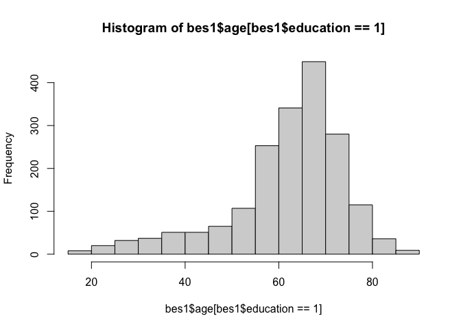

DSS
================
Yuhang Zhu
2023-09-06

# 1. Introduction

# 2.Estimating Casual Effects with Randomized Experiments

## 2.1 Project Start

## 2.2 Treatment and Outcome Variables

*X* -\> *Y*

### 2.2.1 Treatment Variables

X<sub>i</sub> = 1 (treatment) or = 0 (control)

### 2.2.2 Outcome Varibales

reading, math, and graduated

## 2.3 Individual Causal Effects

causal effect of *X* on *Y*

a change in the outcome as $\Delta$*Y*

*Y*<sub>i</sub>(*X*<sub>i</sub>=1) -\> potential outcome under the
treatment condition for individual *i*

*Y*<sub>i</sub>(*X*<sub>i</sub>=0) -\> potential outcome under the
control condition for individual *i*

*individual_effects*<sub>i</sub> = $\Delta$*Y*<sub>i</sub> =
*Y*<sub>i</sub>(*X*<sub>i</sub>=1) - *Y*<sub>i</sub>(*X*<sub>i</sub>=0)

We can never observe the **counter-factual outcome**, which is the
potential outcome that would have occurred under whichever condition was
not received in reality.

**The fundamental problem we face when inferring causal effects is that
we never observe the same individual both receiving the treatment and
not receiving the treatment at the same time.**

## 2.4 Average Causal Effects

**Average causal effect** of the treatment *X* on the outcome *Y*, also
known as the **average treatment effect**, is the average of all the
individual causal effects ox *X* on *Y* within a group.

$\overline{\mathit{individual\_effects}}$ =
$\frac{\sum_{i = 1}^{n} \mathit{individual\_effects}}{\ n}$

We must find or create a situation in which the treated observations and
the untreated observations are similar with respect to all the variables
that might affect the outcome other than the treatment variable itself.
The best way to accomplish this is by conducting a randomized
experiment.

### 2.4.1 Randomized Experiments and the Difference-in-means Estimator

**Randomized experiment** / **randomized controlled trial (RCT)** to
make two groups are comparable to each other, *on average*, in all
respects other than whether or not they received the treatment.

**Pre-treatment characteristics** are the characteristics of the
individuals in a study before the treatment is administered.

average_effect = ${\overline{Y(X=1) - Y(=0)}}$ = ${\overline{Y(X=1)}}$ -
${\overline{Y(X=0)}}$

If the treatment and control groups were comparable before the treatment
was administered, we can estimate the average causal effect of treatment
X on outcome Y with formula as following, which is known as the
difference-in-means estimator:

$\hat{\mathit{individual\_effects}}$ =
${\overline{Y}}$<sub>treatment group</sub> -
${\overline{Y}}$<sub>control group</sub>

experimental data and observational data

## 2.5 Do Small Classes Improve Student Performance?

``` r
star <- read.csv("DSS/STAR.csv")
```

``` r
head(star)
```

    ##   classtype reading math graduated
    ## 1     small     578  610         1
    ## 2   regular     612  612         1
    ## 3   regular     583  606         1
    ## 4     small     661  648         1
    ## 5     small     614  636         1
    ## 6   regular     610  603         0

### 2.5.1 Relational Operators in R

``` r
star$classtype == "small"
```

### 2.5.3 Creating New Variables

``` r
star$small <- ifelse(star$classtype=="small", 1, 0)

head(star)
```

    ##   classtype reading math graduated small
    ## 1     small     578  610         1     1
    ## 2   regular     612  612         1     0
    ## 3   regular     583  606         1     0
    ## 4     small     661  648         1     1
    ## 5     small     614  636         1     1
    ## 6   regular     610  603         0     0

### 2.5.3 Subsetting Vriables

``` r
mean(star$reading)
```

    ## [1] 628.803

``` r
mean(star$reading[star$small==1])
```

    ## [1] 632.7026

``` r
mean(star$reading[star$small==0])
```

    ## [1] 625.492

``` r
mean(star$reading[star$small==1]) - mean(star$reading[star$small==0])
```

    ## [1] 7.210547

``` r
mean(star$math[star$small==1]) - mean(star$math[star$small==0])
```

    ## [1] 5.989905

``` r
mean(star$graduated[star$small==1]) - mean(star$graduated[star$small==0])
```

    ## [1] 0.007031124

# 3. Inferring Population Characteristics via Survey Research

``` r
bes <- read.csv("DSS/BES.csv")
```

``` r
head(bes)
```

    ##         vote leave education age
    ## 1      leave     1         3  60
    ## 2      leave     1        NA  56
    ## 3       stay     0         5  73
    ## 4      leave     1         4  64
    ## 5 don't know    NA         2  68
    ## 6       stay     0         4  85

``` r
dim(bes)
```

    ## [1] 30895     4

``` r
bes_test <- bes %>% 
  mutate(leave_test = ifelse(vote=="leave", 1,
                             ifelse(vote=="stay", 0, NA)))
head(bes_test)
```

    ##         vote leave education age leave_test
    ## 1      leave     1         3  60          1
    ## 2      leave     1        NA  56          1
    ## 3       stay     0         5  73          0
    ## 4      leave     1         4  64          1
    ## 5 don't know    NA         2  68         NA
    ## 6       stay     0         4  85          0

``` r
table(bes$vote)
```

    ## 
    ## don't know      leave       stay won't vote 
    ##       2314      13692      14352        537

``` r
freq_table <- table(bes$vote)
prop.table(freq_table)
```

    ## 
    ## don't know      leave       stay won't vote 
    ## 0.07489885 0.44317851 0.46454119 0.01738145

``` r
# or

prop.table(table(bes$vote))
```

    ## 
    ## don't know      leave       stay won't vote 
    ## 0.07489885 0.44317851 0.46454119 0.01738145

``` r
table(bes$education, exclude = NULL)
```

    ## 
    ##     1     2     3     4     5  <NA> 
    ##  2045  5781  6272 10676  2696  3425

``` r
mean(bes$leave)
```

    ## [1] NA

``` r
mean(bes$leave, na.rm=T)
```

    ## [1] 0.4882328

``` r
bes1 <- na.omit(bes)
```

``` r
reduced_data <- original_data[c("var1", "var2")]
```

``` r
table(bes1$leave, bes1$education)
```

    ##    
    ##        1    2    3    4    5
    ##   0  498 1763 3014 6081 1898
    ##   1 1356 3388 2685 3783  631

``` r
prop.table(table(bes1$leave, bes1$education))
```

    ##    
    ##              1          2          3          4          5
    ##   0 0.01984301 0.07024744 0.12009404 0.24229988 0.07562657
    ##   1 0.05403036 0.13499621 0.10698490 0.15073515 0.02514245

``` r
prop.table(table(bes1$leave, bes1$education), margin=1) #row为1
```

    ##    
    ##              1          2          3          4          5
    ##   0 0.03757356 0.13301645 0.22740305 0.45880489 0.14320205
    ##   1 0.11449802 0.28607616 0.22671620 0.31942920 0.05328042

``` r
prop.table(table(bes1$leave, bes1$education), margin=2) # column为1
```

    ##    
    ##             1         2         3         4         5
    ##   0 0.2686084 0.3422636 0.5288647 0.6164842 0.7504943
    ##   1 0.7313916 0.6577364 0.4711353 0.3835158 0.2495057

``` r
hist(bes1$age)
```

<!-- -->

``` r
hist(bes1$age[bes1$leave == 0])
```

<!-- -->

``` r
hist(bes1$age[bes1$leave == 1])
```

<!-- -->

``` r
bes1 %>% 
  filter(leave == 1) %>% 
  ggplot(aes(x = age)) +
  geom_histogram(binwidth = 5)
```

<!-- -->

``` r
hist(bes1$age[bes1$education == 1])
```

<!-- -->

``` r
hist(bes1$age[bes1$education == 4])
```

<!-- -->

``` r
hist(bes1$age[bes1$education == 1], 
     freq = F)
```

<!-- -->

``` r
hist(bes1$age[bes1$education == 4],
     freq= F)
```

<!-- -->

``` r
hist(bes1$age[bes1$leave == 0], 
     freq = F)
```

<!-- -->

``` r
hist(bes1$age[bes1$leave == 1],
     freq= F)
```

<!-- -->

``` r
mean(bes1$age[bes1$leave == 0])
```

    ## [1] 46.89

``` r
mean(bes1$age[bes1$leave == 1])
```

    ## [1] 55.06823

``` r
median(bes1$age[bes1$leave == 0])
```

    ## [1] 48

``` r
median(bes1$age[bes1$leave == 1])
```

    ## [1] 58

``` r
sd(bes1$age[bes1$leave == 0])
```

    ## [1] 17.3464

``` r
sd(bes1$age[bes1$leave == 1])
```

    ## [1] 14.96106

``` r
var(bes1$age[bes1$leave == 0])
```

    ## [1] 300.8977

``` r
var(bes1$age[bes1$leave == 1])
```

    ## [1] 223.8334

``` r
sd(bes1$age[bes1$leave == 0]) ^ 2
```

    ## [1] 300.8977

``` r
sd(bes1$age[bes1$leave == 1]) ^ 2
```

    ## [1] 223.8334

``` r
sqrt(var(bes1$age[bes1$leave == 0]))
```

    ## [1] 17.3464

``` r
sqrt(var(bes1$age[bes1$leave == 1]))
```

    ## [1] 14.96106

``` r
dis <- read.csv("DSS/UK_districts.csv")
```

``` r
head(dis)
```

    ##             name leave high_education
    ## 1     Birmingham 50.42          22.98
    ## 2        Cardiff 39.98          32.33
    ## 3 Edinburgh City 25.56          21.92
    ## 4   Glasgow City 33.41          25.91
    ## 5      Liverpool 41.81          22.44
    ## 6        Swansea 51.51          25.85

``` r
dim(dis)
```

    ## [1] 382   3

``` r
dis1 <- na.omit(dis)

dim(dis1)
```

    ## [1] 380   3

``` r
plot(dis1$high_education, dis1$leave)
abline(v=mean(dis1$high_education), lty="dashed")
abline(h=mean(dis1$leave), lty="dashed")
```

<!-- -->

``` r
cor(dis1$high_education, dis1$leave)
```

    ## [1] -0.7633185
