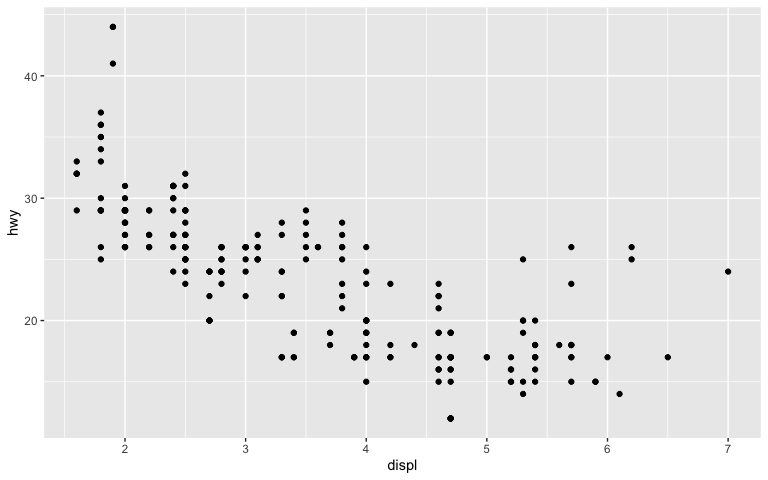
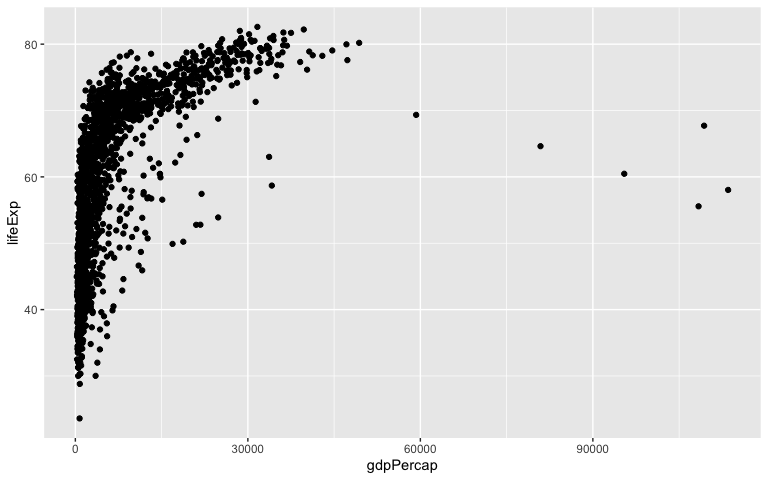

Data Visualization Notes
================
Yuhang Zhu
2023-8-27

## Data Visualization Notes

This is a starter RMarkdown template to accompany *Data Visualization*
(Princeton University Press, 2019). You can use it to take notes, write
your code, and produce a good-looking, reproducible document that
records the work you have done. At the very top of the file is a section
of *metadata*, or information about what the file is and what it does.
The metadata is delimited by three dashes at the start and another three
at the end. You should change the title, author, and date to the values
that suit you. Keep the `output` line as it is for now, however. Each
line in the metadata has a structure. First the *key* (“title”,
“author”, etc), then a colon, and then the *value* associated with the
key.

## This is an RMarkdown File

Markdown is a simple formatting syntax for authoring HTML, PDF, and MS
Word documents. For more details on using R Markdown see
<http://rmarkdown.rstudio.com>.

When you click the **Knit** button a document will be generated that
includes both content as well as the output of any embedded R code
chunks within the document. A *code chunk* is a specially delimited
section of the file. You can add one by moving the cursor to a blank
line choosing Code \> Insert Chunk from the RStudio menu. When you do,
an empty chunk will appear:

Code chunks are delimited by three backticks (found to the left of the 1
key on US and UK keyboards) at the start and end. The opening backticks
also have a pair of braces and the letter `r`, to indicate what language
the chunk is written in. You write your code inside the code chunks.
Write your notes and other material around them, as here.

## Before you Begin

To install the tidyverse, make sure you have an Internet connection.
Then *manually* run the code in the chunk below. If you knit the
document if will be skipped. We do this because you only need to install
these packages once, not every time you run this file. Either knit the
chunk using the little green “play” arrow to the right of the chunk
area, or copy and paste the text into the console window.

``` r
## This code will not be evaluated automatically.
## (Notice the eval = FALSE declaration in the options section of the
## code chunk)

my_packages <- c("tidyverse", "broom", "coefplot", "cowplot",
                 "gapminder", "GGally", "ggrepel", "ggridges", "gridExtra",
                 "here", "interplot", "margins", "maps", "mapproj",
                 "mapdata", "MASS", "quantreg", "rlang", "scales",
                 "survey", "srvyr", "viridis", "viridisLite", "devtools")

install.packages(my_packages, repos = "http://cran.rstudio.com")
```

## Set Up Your Project and Load Libraries

To begin we must load some libraries we will be using. If we do not load
them, R will not be able to find the functions contained in these
libraries. The tidyverse includes ggplot and other tools. We also load
the socviz and gapminder libraries.

Notice that here, the braces at the start of the code chunk have some
additional options set in them. There is the language, `r`, as before.
This is required. Then there is the word `setup`, which is a label for
your code chunk. Labels are useful to briefly say what the chunk does.
Label names must be unique (no two chunks in the same document can have
the same label) and cannot contain spaces. Then, after the comma, an
option is set: `include=FALSE`. This tells R to run this code but not to
include the output in the final document.

When you click the **Knit** button a document will be generated that
includes both content as well as the output of any embedded R code
chunks within the document. You can embed an R code chunk like this:

``` r
gapminder
```

    ## # A tibble: 1,704 × 6
    ##    country     continent  year lifeExp      pop gdpPercap
    ##    <fct>       <fct>     <int>   <dbl>    <int>     <dbl>
    ##  1 Afghanistan Asia       1952    28.8  8425333      779.
    ##  2 Afghanistan Asia       1957    30.3  9240934      821.
    ##  3 Afghanistan Asia       1962    32.0 10267083      853.
    ##  4 Afghanistan Asia       1967    34.0 11537966      836.
    ##  5 Afghanistan Asia       1972    36.1 13079460      740.
    ##  6 Afghanistan Asia       1977    38.4 14880372      786.
    ##  7 Afghanistan Asia       1982    39.9 12881816      978.
    ##  8 Afghanistan Asia       1987    40.8 13867957      852.
    ##  9 Afghanistan Asia       1992    41.7 16317921      649.
    ## 10 Afghanistan Asia       1997    41.8 22227415      635.
    ## # ℹ 1,694 more rows

The remainder of this document contains the chapter headings for the
book, and an empty code chunk in each section to get you started. Try
knitting this document now by clicking the “Knit” button in the RStudio
toolbar, or choosing File \> Knit Document from the RStudio menu.

## Look at Data

## Get Started

### 2.3 Things to Know about R

#### *Everything is an object*

``` r
my_numbers <- c(1, 2, 3, 1, 3, 5, 25)
your_numbers <-  c(5, 31, 71, 1, 3, 21, 6)
my_numbers
```

    ## [1]  1  2  3  1  3  5 25

``` r
mean(x= my_numbers)
```

    ## [1] 5.714286

``` r
mean(your_numbers)
```

    ## [1] 19.71429

``` r
my_summary <- summary(my_numbers)
my_summary
```

    ##    Min. 1st Qu.  Median    Mean 3rd Qu.    Max. 
    ##   1.000   1.500   3.000   5.714   4.000  25.000

#### *Functions come in packages*

``` r
table(my_numbers)
```

    ## my_numbers
    ##  1  2  3  5 25 
    ##  2  1  2  1  1

``` r
sd(my_numbers)
```

    ## [1] 8.616153

#### *If you’re not sure what an object is, ask for its class*

``` r
class(my_numbers)
```

    ## [1] "numeric"

``` r
class(my_summary)
```

    ## [1] "summaryDefault" "table"

``` r
class(summary)
```

    ## [1] "function"

``` r
my_new_vector <-  c(my_numbers, "Apple")
my_new_vector
```

    ## [1] "1"     "2"     "3"     "1"     "3"     "5"     "25"    "Apple"

``` r
class(my_new_vector)
```

    ## [1] "character"

``` r
titanic
```

    ##       fate    sex    n percent
    ## 1 perished   male 1364    62.0
    ## 2 perished female  126     5.7
    ## 3 survived   male  367    16.7
    ## 4 survived female  344    15.6

``` r
class(titanic)
```

    ## [1] "data.frame"

``` r
titanic$percent
```

    ## [1] 62.0  5.7 16.7 15.6

``` r
titanic_tb <-  as_tibble(titanic)
titanic_tb
```

    ## # A tibble: 4 × 4
    ##   fate     sex        n percent
    ##   <fct>    <fct>  <dbl>   <dbl>
    ## 1 perished male    1364    62  
    ## 2 perished female   126     5.7
    ## 3 survived male     367    16.7
    ## 4 survived female   344    15.6

#### *To see inside an object, ask for its structure*

``` r
str(my_numbers)
```

    ##  num [1:7] 1 2 3 1 3 5 25

``` r
str(my_summary)
```

    ##  'summaryDefault' Named num [1:6] 1 1.5 3 5.71 4 ...
    ##  - attr(*, "names")= chr [1:6] "Min." "1st Qu." "Median" "Mean" ...

### 2.4 Be Patient with R, and with Yourself

- Here are three specific things to watch out for:
  - Make sure parentheses are balanced and that every opening “(” has a
    corresponding closing “)”.  
  - Make sure you complete your expressions.
  - In ggplot specifically, as you will see, we will build up plots a
    piece at a time by adding expressions to one another. When doing
    this, make sure your + character goes at the end of the line and not
    the beginning.

``` r
ggplot(data = mpg, aes(x = displ, y = hwy)) + geom_point()
```

<!-- -->

### 2.5 Get Data into R

``` r
url  <-  "https://cdn.rawgit.com/kjhealy/viz-organdata/master/organdonation.csv" 
organs <-  read_csv(file = url)
```

    ## Rows: 238 Columns: 21
    ## ── Column specification ────────────────────────────────────────────────────────
    ## Delimiter: ","
    ## chr  (7): country, world, opt, consent.law, consent.practice, consistent, ccode
    ## dbl (14): year, donors, pop, pop.dens, gdp, gdp.lag, health, health.lag, pub...
    ## 
    ## ℹ Use `spec()` to retrieve the full column specification for this data.
    ## ℹ Specify the column types or set `show_col_types = FALSE` to quiet this message.

### 2.6 Make Your First Figure

``` r
library(gapminder)
gapminder
```

    ## # A tibble: 1,704 × 6
    ##    country     continent  year lifeExp      pop gdpPercap
    ##    <fct>       <fct>     <int>   <dbl>    <int>     <dbl>
    ##  1 Afghanistan Asia       1952    28.8  8425333      779.
    ##  2 Afghanistan Asia       1957    30.3  9240934      821.
    ##  3 Afghanistan Asia       1962    32.0 10267083      853.
    ##  4 Afghanistan Asia       1967    34.0 11537966      836.
    ##  5 Afghanistan Asia       1972    36.1 13079460      740.
    ##  6 Afghanistan Asia       1977    38.4 14880372      786.
    ##  7 Afghanistan Asia       1982    39.9 12881816      978.
    ##  8 Afghanistan Asia       1987    40.8 13867957      852.
    ##  9 Afghanistan Asia       1992    41.7 16317921      649.
    ## 10 Afghanistan Asia       1997    41.8 22227415      635.
    ## # ℹ 1,694 more rows

``` r
p <- ggplot(gapminder, 
            mapping = aes(x = gdpPercap, y = lifeExp))
p + geom_point()
```

<!-- -->

## Make a Plot

## Show the Right Numbers

## Graph Tables, Make Labels, Add Notes

## Work with Models

## Draw Maps

## Refine your Plots
