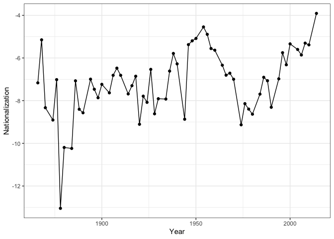
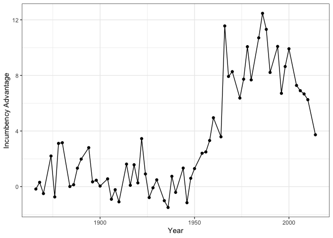
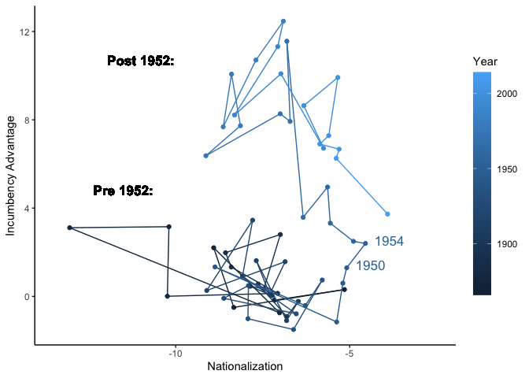
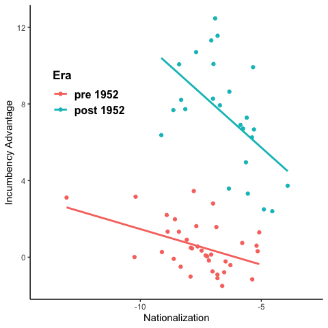

Final Exam
================
Yuhang Zhu
2023-12-08

# POLI 210

## Quantitative Analysis I

## Final Examination

### Part I:

Open the R script part_one_replication_script.R. Fill in the code as
needed. The code is broken up into 7 tasks (noted in the code’s
comments). I should be able to run your R file and get the correct
answers.

Do not look up the answer by googling the paper on which this
replication file is based. I have included a copy of th e paper without
the replication file in this repo.

``` r
cq_data <- read.csv("/Users/zhuyuhang/Desktop/Git/POLI210/Final Exam/cq_data.csv")

head(cq_data)
```

    ##   X year stcd ptynow inc3    dv   dvp state south
    ## 1 1 1876  101      1    0 49.25 46.45     1     1
    ## 2 2 1878  101      1    0 69.10 49.25     1     1
    ## 3 3 1880  101      1    0 55.94 69.10     1     1
    ## 4 4 1884  101      1    0 58.08 57.40     1     1
    ## 5 5 1890  101      1    0 69.89 62.00     1     1
    ## 6 6 1894  101      1    1 76.89 63.62     1     1

``` r
dim(cq_data)
```

    ## [1] 17932     9

#### 1

``` r
# 1 Write a function called nationalization that takes two vectors called "dv" and "dvp, and returns a single number that corresponds to the measure "nationalization" in the paper by LeVeck and Nail. Make sure to handle NA's. You don't have to worry about the fact that the measure is computed for a specific year, that's handled later. You can just assume all dv and dvp observations come from one year.
nationalization <- function(dv, dvp){
  vote_swing = dv - dvp
  sd_vote_swing = sd(vote_swing, na.rm = T) 
  nationalization <- -1 * sd_vote_swing
  return(nationalization)   
}
```

#### 2

``` r
# 2 Calculate nationalization measure by year
swing_variance <- cq_data %>%
  filter(inc3 != 0) %>%
  group_by(year) %>%
  summarise(nationalization = nationalization(dv, dvp)) %>%
  ungroup()
```

``` r
# Calculate correlation between Gary J' measure and our measure of nationalization

# load gary j's data 
gary_j_data <- read.csv("/Users/zhuyuhang/Desktop/Git/POLI210/Final Exam/gary_j_data.csv")

# Make a dataset with both our measure and gary J's measure of nationalization for every year.
measure_comparison <- gary_j_data %>%
  filter(year >= 1954) %>%
  group_by(year) %>%
  summarise(nationalization1 = nationalization(dv, dvp), # our measure
            nationalization2 = cor(dv,dpres, use = "pairwise.complete.obs") # garyj's measure
            )

cor(measure_comparison$nationalization1, measure_comparison$nationalization2)
```

    ## [1] 0.7920573

#### 3

``` r
# 3 compare the pearson correlation between our measure and gary j's nationalization measure
cor_comparison <- cor.test(measure_comparison$nationalization1, measure_comparison$nationalization2, method = "pearson")
cor_comparison$estimate
```

    ##       cor 
    ## 0.7920573

``` r
cor_comparison$p.value
```

    ## [1] 2.386109e-06

``` r
# Since the p-value is 2.386e-06, we can reject the null hypothesis that true correlation between our measure and gary j's nationalization measure is equal to 0. 
# In other words, our measurement is highly correlated (0.79) with Gary J's measurement statistically (p < 0.001).
```

``` r
b_incumbency_adv <- cq_data %>%
  group_by(year) %>% 
  do(., tidy(lm(dv ~ dvp + ptynow + inc3, data = . ))) %>% 
  filter(term == "inc3") %>%
  ungroup() %>% 
  left_join(., swing_variance, by="year") %>% # join to nationalization measure
  mutate(post_1952 = as.numeric(year > 1952)) # dummy for whether the year is after
# 1952

# Add in markers for 1950 and 1954
# This will be used in figure 1c
b_incumbency_adv$marker_break <- NA
b_incumbency_adv$marker_break[b_incumbency_adv$year==1950] <- 1950
b_incumbency_adv$marker_break[b_incumbency_adv$year==1954] <- 1954
```

#### 4

``` r
# plot nationalization over time 
# this is all done for you, but you can try to learn about making graphics from this code might be useful in the future?
nationalization_year_plot <- ggplot(data = swing_variance, 
                                    aes(x= year, 
                                        y= nationalization)) +
  geom_line() +
  geom_point() +
  theme_bw() + ylab("Nationalization") + xlab("Year")

# 4 run the line below to make sure that you get a similar graph to 1a
# it won't have standard error bars like the main paper. 5pts extra credit if you can get those by bootstrapping your nationalization measure in every year
nationalization_year_plot
```

<!-- -->

``` r
# it won't have standard error bars like the main paper. 5pts extra credit if you can get those by bootstrapping your nationalization measure in every year

# I think there are two for-loops, but I fail to achieve it.
# The first loop is for year[i]. We should subset year[i] and
# resample the subset, and get subset[j].
# For each subset[j], we need to calculate the sd(vote_swing), and then
# aggregate sd(vote_swing) by year[i] to get nationalization[ij]
# We will get 10000 nationalization[i], and calculate the sd(nationalization[i]) to get the se for each year.
```

#### 5

``` r
# plot incumbency advantage over time
incumbency_adv_year_plot <- ggplot(data=b_incumbency_adv, 
                                   aes(x=year, y=estimate)) +
  geom_line() +
  geom_point() +
  theme_bw() + ylab("Incumbency Advantage") + xlab("Year")

# 5 run the line below to make sure that you get a similar graph to 1b
incumbency_adv_year_plot
```

<!-- -->

#### 6

``` r
# 6a Find the pearson correlation between nationalization and the incumbency advantage by era (pre 1952 and post 1952) using the b_incumbency_adv data
pre1952_cor <- cor.test(b_incumbency_adv$nationalization[b_incumbency_adv$post_1952==0], b_incumbency_adv$estimate[b_incumbency_adv$post_1952==0], method = "pearson")
pre1952_cor$estimate
```

    ##        cor 
    ## -0.4552913

``` r
post1952_cor <- cor.test(b_incumbency_adv$nationalization[b_incumbency_adv$post_1952==1], b_incumbency_adv$estimate[b_incumbency_adv$post_1952==1], method = "pearson")
post1952_cor$estimate
```

    ##        cor 
    ## -0.5360946

``` r
# 6b Find the spearman correlation between nationalization and the incumbency advantage by era (pre 1952 and post 1952) using the b_incumbency_adv data
pre1952_cor <- cor.test(b_incumbency_adv$nationalization[b_incumbency_adv$post_1952==0], b_incumbency_adv$estimate[b_incumbency_adv$post_1952==0], method = "spearman")
pre1952_cor$estimate
```

    ##        rho 
    ## -0.3842986

``` r
post1952_cor <- cor.test(b_incumbency_adv$nationalization[b_incumbency_adv$post_1952==1], b_incumbency_adv$estimate[b_incumbency_adv$post_1952==1], method = "spearman")
post1952_cor$estimate
```

    ##        rho 
    ## -0.5761538

#### 7

``` r
# Plot relationship between nationalization and the incumbency advantage
nationalization_incumbency_path_plot <- ggplot(data = b_incumbency_adv, 
                                               aes(x = nationalization, 
                                                   y = estimate)) + 
  geom_point(aes(colour = year)) +
  geom_path(aes(color = year)) +
  geom_text(size = 4.5, aes(color = year, label = marker_break, hjust = -.3, vjust = .2)) +
  geom_text(label = "Post 1952:",
            x=-11, y=10.7, size=4.5, fontface="bold") +
  geom_text(label= "Pre 1952:",
            x=-11.5, y=4.8, size=4.5,fontface="bold") +
  theme_classic() + 
  xlab("Nationalization") + 
  ylab("Incumbency Advantage") +
  scale_color_continuous(name = "Year") +
  xlim(c(-13.5,-2.5)) +
  theme(legend.key.height = unit(1.5, "cm"),
        legend.title.align = 0)

# 7 run the line below to make sure you get a similar plot to panel 1c
# This will look slightly different than plot 1c, which is a scatter plot
# This is a path diagram, which connects points in temporal order
nationalization_incumbency_path_plot
```

    ## Warning: Removed 59 rows containing missing values (`geom_text()`).

<!-- -->

``` r
nationalization_incumbency_point_plot <- ggplot(data = b_incumbency_adv, 
                                               aes(x = nationalization, 
                                                   y = estimate)) + 
  geom_point(aes(colour = factor(post_1952))) +
  geom_smooth(aes(colour = factor(post_1952)), method = "lm", se=FALSE, formula = y ~ x) +
  scale_color_discrete(labels = c("pre 1952", "post 1952")) +
  scale_x_continuous(limits = c(-14, -3), breaks = seq(-10, -5, 5)) +
  labs(color = "Era") +
  xlab("Nationalization") + 
  ylab("Incumbency Advantage") +
  theme(
    panel.background = element_rect(fill = "transparent", colour = NA),
    panel.border = element_blank(),
    panel.grid = element_blank(),
    axis.line = element_line(colour = "black"),
    legend.key = element_rect(fill = "transparent"),
    legend.text = element_text(face = "bold", size = 12),
    legend.title = element_text(face = "bold", size = 13),
    legend.position = c(.2, .7))

nationalization_incumbency_point_plot
```

<!-- -->

### Part II:

Answer the questions below. Insert code chunks as necessary.

1)  We have a variable that lists income in units of ‘thousands of
    dollars’ (1, 2, 3, etc) but we recode it into actual dollars. That
    is, we multiply our original variable by 1000.

    1)  Will this change the mean of the variable?

        **Answer**: Yes, the mean of the variable will also be
        multiplied by 1000.

    2)  Will this change the variance of the variable?

        **Answer**: Yes, the variance will be multiplied by 1000^2.

    3)  Create an example of this in R, and show the result from part a
        and b above in a sensible way.

``` r
set.seed(1234)

income <- sample(1:100, 100, replace = T)

mincome <- mean(income)
mincome
```

    ## [1] 49.6

``` r
varincome <- var(income)
varincome
```

    ## [1] 889.1919

``` r
income_1000 <- income * 1000

mincome_1000 <- mean(income_1000)
mincome_1000
```

    ## [1] 49600

``` r
varincome_1000 <- var(income_1000)
varincome_1000
```

    ## [1] 889191919

``` r
mincome_1000 / mincome
```

    ## [1] 1000

``` r
varincome_1000 /varincome
```

    ## [1] 1e+06

2)  Imagine you run an experiment where you randomly assign individuals
    to receive one of two mailers. Call one mailer the *treatment*, and
    the other mailer *control*. Your dependent variable is turnout. Of
    the 1000 people sent the treatment mailer, 380 turnout in the next
    election. Of the 1000 people sent the control mailer, 302 turnout in
    the next election.

    1)  What is your best estimate of difference in turnout rates
        between the two groups?

        **Answer**: The difference in average turnout between
        individuals assigned to the treatment and individuals assigned
        to the control (i.e. ATE).

    2)  Estimate the standard error of this difference using R. Show
        your calculations.

        **Answer**: sd = 0.021.

``` r
m_treat_turnout <- 380 / 1000
m_control_turnout <- 302 / 1000

ate <- m_treat_turnout - m_control_turnout

var_treat_turnout <- ((380 * ((1 - m_treat_turnout) ^ 2)) + ((1000 - 380) * ((0 - m_treat_turnout) ^ 2))) / 1000
var_control_turnout <- ((302 * ((1 - m_control_turnout) ^ 2)) + ((1000 - 302) * ((0 - m_control_turnout) ^ 2))) / 1000

sd_ate <- sqrt(var_treat_turnout / 1000 + var_control_turnout / 1000)

sd_ate
```

    ## [1] 0.02112809

    c)  Estimate a:

        i)  90% confidence interval for the difference

             **Answer**: [0.043, 0.113]
             

``` r
ate - qnorm(1 - 0.1 / 2) * sd_ate 
```

    ## [1] 0.04324739

``` r
ate + qnorm(1 - 0.1 / 2) * sd_ate
```

    ## [1] 0.1127526

        ii) 95% confidence interval for the difference

             **Answer**: [0.037, 0.119]
             

``` r
ate - qnorm(1 - 0.05 / 2) * sd_ate 
```

    ## [1] 0.03658971

``` r
ate + qnorm(1 - 0.05 / 2) * sd_ate
```

    ## [1] 0.1194103

    d)  Say we pick an alpha of 0.05, can we reject the null hypothesis that there is no difference in turnout between the two groups?

        **Answer**: Yes. We can reject the null hypothesis (*p* = 3.69 > 1.96) which means the difference is significant statistically.

``` r
ate / sd_ate
```

    ## [1] 3.691768

3)  According to the Pew Research Center for the People and the Press,
    in 2003, the contact rate for surveyors was 76%. That is 76% of the
    numbers they try to reach (which have been generated by random digit
    dialers) are successfully reached. Assume that any one household’s
    response is independent of all others. Answer the following
    questions. You may do so using calculation or simulation. Show your
    code/work as much as possible.

    1)  What is the probability that an interviewer will contact the
        next household on her list?

        **Answer**: Since the response of each household is independent
        of others, the probability of successfully contacting the next
        household on the interviewer’s list is 76%.

``` r
set.seed(1234)

sample_contact <- c(1, 0)

event_probs_contact <- c(0.76, 0.24)

contact <- function(){
  sample(
    size = 1,
    x = sample_contact,
    prob = event_probs_contact,
    replace = TRUE
  )
}

nsims <- 100000

contact_sims <- vector(mode = 'numeric', length = nsims)

for(i in 1:nsims){
  contact_sims[i] <- contact()
}

mean(contact_sims)
```

    ## [1] 0.75961

    b)  What is the probability that the interviewer will contact the next two households on her list?

        **Answer**: The probability of contacting households consecutively is 0.76 * 0.76 = 0.5776 (57.76%).

``` r
0.76 * 0.76
```

    ## [1] 0.5776

``` r
set.seed(1234)

nsims <- 100000

contact_sims_1 <- vector(mode = 'numeric', length = nsims)
contact_sims_2 <- vector(mode = 'numeric', length = nsims)

count <- 0

for(i in 1:nsims){
  contact_sims_1[i] <- contact()
  contact_sims_2[i] <- contact()
  
  if(contact_sims_1[i] == 1 & contact_sims_2[i] == 1) {
    count <- count + 1
  }
}

prob <- count / nsims
prob
```

    ## [1] 0.57705

    c)  What is the probability that the interviewer will make at least one successful contact among the next five households on her list?

        **Answer**: The probability of this event is 1 - P(no successful contact) = 1 - (1 - 0.76)^5 = 0.999 (99.9%).
        

``` r
1 - (1 - 0.76) ^ 5
```

    ## [1] 0.9992037

``` r
set.seed(1234)

nsims <- 100000

contact_sims_1 <- vector(mode = 'numeric', length = nsims)
contact_sims_2 <- vector(mode = 'numeric', length = nsims)
contact_sims_3 <- vector(mode = 'numeric', length = nsims)
contact_sims_4 <- vector(mode = 'numeric', length = nsims)
contact_sims_5 <- vector(mode = 'numeric', length = nsims)

count <- 0

for(i in 1:nsims){
  contact_sims_1[i] <- contact()
  contact_sims_2[i] <- contact()
  contact_sims_3[i] <- contact()
  contact_sims_4[i] <- contact()
  contact_sims_5[i] <- contact()
  
  if(contact_sims_1[i] == 0 & 
     contact_sims_2[i] == 0 & 
     contact_sims_3[i] == 0 & 
     contact_sims_4[i] == 0 & 
     contact_sims_5[i] == 0
     ) {
    count <- count + 1
  }
}

prob <- 1- count / nsims
prob
```

    ## [1] 0.99928

4)  We have data from 10 city council elections recording the vote share
    of each candidate. We are interested to know whether or not
    incumbents have a significant vote advantage at the local level.

| Incumbent | Challenger |
|-----------|------------|
| .359      | 0.641      |
| .511      | 0.489      |
| .467      | 0.533      |
| .643      | 0.357      |
| .521      | 0.479      |
| .671      | 0.329      |
| .491      | 0.509      |
| .228      | 0.772      |
| .905      | 0.095      |
| .503      | 0.497      |

1)  State the null and research hypotheses.

    **Answer**: The null hypothesis is the average vote share difference
    between incumbents and challengers is equal to zero, while the
    alternative hypothesis is the difference is not equal to zero.

2)  Run an appropriate test in R and paste your results.

    **Answer**: I run a t-test to test the hypothsis. The result is as
    follows:

``` r
Welch Two Sample t-test

data:  vote_share_data$incumbent_i and vote_share_data$chanllenger_i
t = 0.73193, df = 18, p-value = 0.4736
alternative hypothesis: true difference in means is not equal to 0
95 percent confidence interval:
 -0.1118484  0.2314484
sample estimates:
mean of x mean of y 
   0.5299    0.4701 
```

``` r
elections_i <- 1:10

incumbent_i <- c(.359, .511, .467, .643, .521, .671, .491, .228, .905, .503)

chanllenger_i <- c(0.641, 0.489, 0.533, 0.357, 0.479, 0.329, 0.509, 0.772, 0.095, 0.497)

vote_share_data <- data.frame(elections_i, incumbent_i, chanllenger_i)

t.test(vote_share_data$incumbent_i, vote_share_data$chanllenger_i, alternative = "two.sided")
```

    ## 
    ##  Welch Two Sample t-test
    ## 
    ## data:  vote_share_data$incumbent_i and vote_share_data$chanllenger_i
    ## t = 0.73193, df = 18, p-value = 0.4736
    ## alternative hypothesis: true difference in means is not equal to 0
    ## 95 percent confidence interval:
    ##  -0.1118484  0.2314484
    ## sample estimates:
    ## mean of x mean of y 
    ##    0.5299    0.4701

3)  What is the p-value for your test statistic?

    **Answer**: The p-value im my test is equal to 0.24, which means we
    cannot reject the null hypothesis.

4)  State your conclusions.

    **Answer**: After running a t test based on the data from 10 city
    council elections, we cannot reject the null hypothesis (*p* =
    0.24), which argues the average vote share difference between
    incumbents and challengers is equal to zero. In other words,
    incumbents do not have a significant vote advantage at the local
    level.
