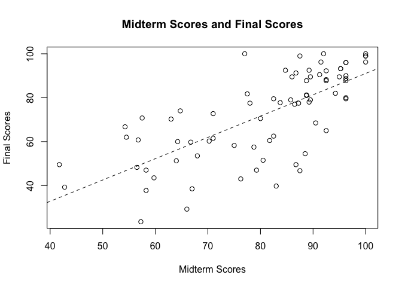
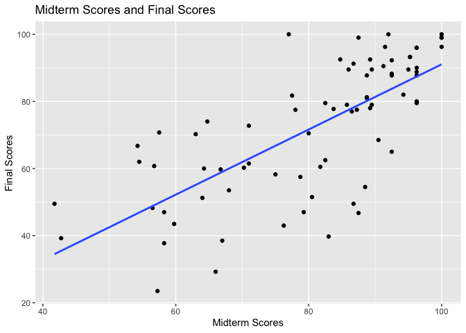
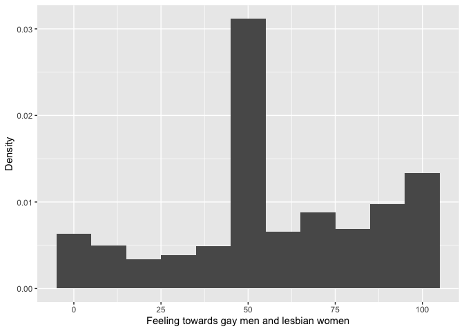
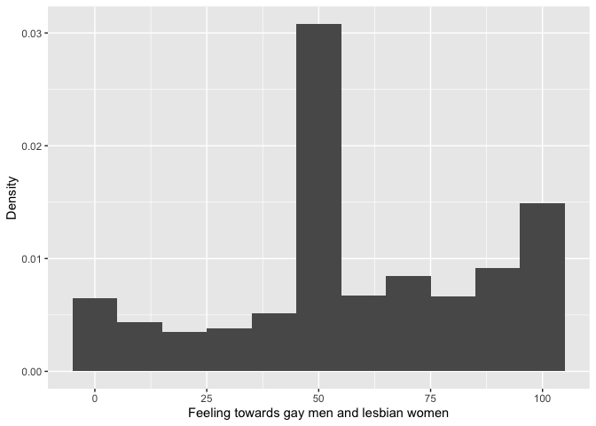
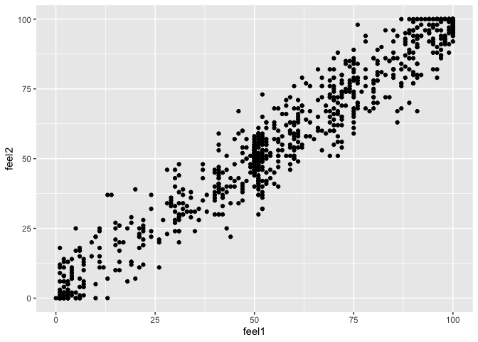
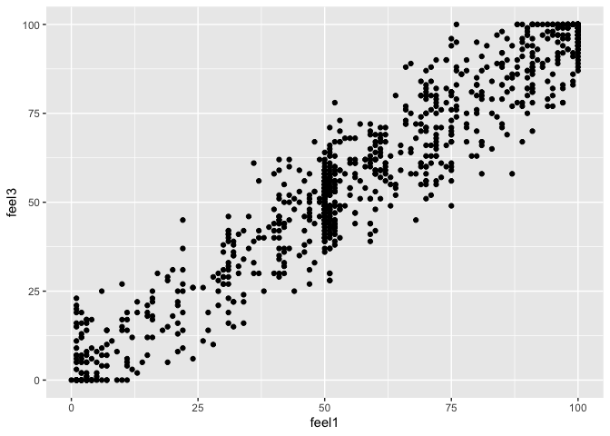
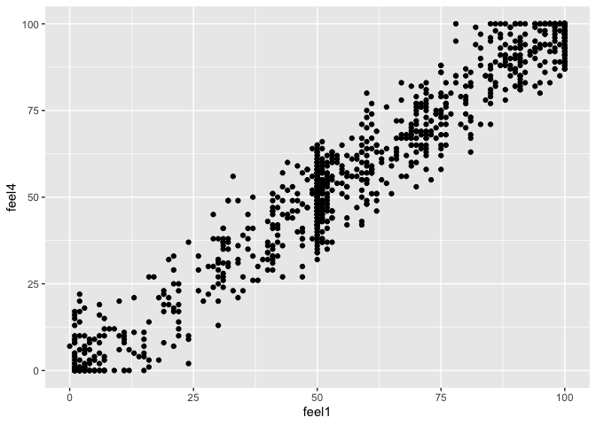

HW_B2
================
Yuhang Zhu
2023-10-02

# Predicting Course Grades Using Midterm Scores Part I: Predicting Final Exam Scores

``` r
grades <- read.csv("B2/grades.csv")

head(grades)
```

    ##   midterm final overall gradeA
    ## 1   79.25 47.00    69.2      0
    ## 2   96.25 87.75    94.3      1
    ## 3   58.25 37.75    62.0      0
    ## 4   54.50 62.00    72.4      0
    ## 5   83.00 39.75    72.4      0
    ## 6   41.75 49.50    59.5      0

``` r
dim(grades)
```

    ## [1] 76  4

## 1. First, let’s figure out what each observation represents, identify our X and Y variables, and explore whether they are moderately or strongly linearly associated with each other.

### 1a

Each observation represents a student’s midterm score, final score,
overall score, and whether they earned an A or A-.

### 1b

Our independent variable, `midterm`, is numeric and not binary.

``` r
str(grades)
```

    ## 'data.frame':    76 obs. of  4 variables:
    ##  $ midterm: num  79.2 96.2 58.2 54.5 83 ...
    ##  $ final  : num  47 87.8 37.8 62 39.8 ...
    ##  $ overall: num  69.2 94.3 62 72.4 72.4 59.5 83.4 71.5 63.3 92.9 ...
    ##  $ gradeA : int  0 1 0 0 0 0 0 0 0 1 ...

``` r
summary(grades$midterm)
```

    ##    Min. 1st Qu.  Median    Mean 3rd Qu.    Max. 
    ##   41.75   69.69   85.88   80.64   92.12  100.00

### 1c

Our dependent variable, `final`, is also numeric and not binary.

``` r
summary(grades$final)
```

    ##    Min. 1st Qu.  Median    Mean 3rd Qu.    Max. 
    ##   23.50   58.06   77.50   72.25   89.50  100.00

### 1d

The correlation coefficient between X and Y is strongly linear.

``` r
cor(grades$midterm, grades$final)
```

    ## [1] 0.7160323

## 2. Second, let’s fit the linear model that we will use to make predictions.

### 2a

``` r
fit <- lm(final ~ midterm, grades)

fit
```

    ## 
    ## Call:
    ## lm(formula = final ~ midterm, data = grades)
    ## 
    ## Coefficients:
    ## (Intercept)      midterm  
    ##     -6.0059       0.9704

### 2b

$$\hat{final} = -6.0059 + 0.9704 midterm $$

### 2c

``` r
plot(grades$midterm, grades$final,
     xlab = "Midterm Scores",
     ylab = "Final Scores",
     main = "Midterm Scores and Final Scores")
abline(lm(final ~ midterm, grades), lty = "dashed")
```

<!-- -->

``` r
# also:
ggplot(grades, aes(midterm, final)) +
  geom_point() +
  geom_smooth(method = lm, se = F) +
  labs(x = "Midterm Scores", 
       y = "Final Scores",
       title = "Midterm Scores and Final Scores")
```

    ## `geom_smooth()` using formula = 'y ~ x'

<!-- -->

## 3. Now, let’s use the fitted line to make some predictions.

### 3a

If a student earns 80 points in the midterm, the points he or she may
earn in the final exam are 71.6.

``` r
-6.0059 + 0.9704 * 80
```

    ## [1] 71.6261

### 3b

If a student earns 90 points in the midterm, the points he or she may
earn in the final exam are 81.3.

``` r
-6.0059 + 0.9704 * 90
```

    ## [1] 81.3301

### 3c

If a student earns extra 10 points in the midterm, the extra points he
or she may earn in the final exam are 9.7.

``` r
0.9704 * 10
```

    ## [1] 9.704

## 4. What is the R<sup>2</sup> of the fitted model? And, how would you interpret it?

The R<sup>2</sup> of the fitted model is 0.51, which indicates that 51%
variance in final exam scores can be explained by midterm scores.

``` r
r <- cor(grades$midterm, grades$final)
r2 <- r * r
r2
```

    ## [1] 0.5127023

``` r
# also:
fit_model <- summary(fit)
r_square <- fit_model$r.squared
r_square
```

    ## [1] 0.5127023

# Evidence of Data Fabrication

``` r
gay <- read.csv("B2/gay.csv")
ccap <- read.csv("B2/CCAP.csv")

head(gay, 4)
```

    ##    treatment feel1 feel2 feel3 feel4
    ## 1 No Contact     2     6     0     6
    ## 2 No Contact    91    90   100    93
    ## 3 No Contact    46    67    38    46
    ## 4 No Contact     6     0    NA    16

``` r
head(ccap, 4)
```

    ##   feel
    ## 1  100
    ## 2    6
    ## 3   61
    ## 4   50

``` r
dim(gay)
```

    ## [1] 2441    5

``` r
dim(ccap)
```

    ## [1] 43998     1

## Question 1

Yes, these two distributions look similar.

``` r
ggplot(ccap, aes(feel, after_stat(density))) +
  geom_histogram(binwidth=10) +
  labs(x = "Feeling towards gay men and lesbian women",
       y = "Density")
```

<!-- -->

``` r
ggplot(gay, aes(feel1, after_stat(density))) +
  geom_histogram(binwidth=10) +
  labs(x = "Feeling towards gay men and lesbian women",
       y = "Density")
```

<!-- -->

## Question 2

Yes, the two distributions have similar descriptive statistics.

``` r
sum_ccap <- ccap %>% 
  summarise(mean_feel = mean(feel, na.rm = TRUE),
            median_feel = median(feel, na.rm = TRUE),
            sd_feel = sd(feel, na.rm = TRUE))
sum_ccap
```

    ##   mean_feel median_feel  sd_feel
    ## 1  58.09241          52 28.40383

``` r
sum_gay <- gay %>% 
  summarise(mean_feel1 = mean(feel1, na.rm = TRUE),
            median_feel1 = median(feel1, na.rm = TRUE),
            sd_feel1 = sd(feel1, na.rm = TRUE))
sum_gay
```

    ##   mean_feel1 median_feel1 sd_feel1
    ## 1   58.62884           52 28.55804

## Question 3

The demographic characteristics of the national sample differ from those
of Los Angeles County. Thus, the similarity between the two
distributions is unexpected.

## Question 4

Yes. The respondents in the gay marriage experiment dataset have
relatively stable feelings over the whole period of time.

``` r
control <- c("No Contact")

# 4a
ggplot(subset(gay, subset = treatment %in% control),
       aes(feel1, feel2)) +
  geom_point()
```

<!-- -->

``` r
# 4b
ggplot(subset(gay, subset = treatment %in% control),
       aes(feel1, feel3)) +
  geom_point()
```

<!-- -->

``` r
# 4c
ggplot(subset(gay, subset = treatment %in% control),
       aes(feel1, feel4)) +
  geom_point()
```

<!-- -->

## Question 5

Yes. These variables highly correlated with each other.

``` r
# 5a
cor(gay$feel1[gay$treatment=="No Contact"], gay$feel2[gay$treatment=="No Contact"], use = "complete.obs")
```

    ## [1] 0.9734449

``` r
# 5b
cor(gay$feel1[gay$treatment=="No Contact"], gay$feel3[gay$treatment=="No Contact"], use = "complete.obs")
```

    ## [1] 0.9594085

``` r
# 5c
cor(gay$feel1[gay$treatment=="No Contact"], gay$feel4[gay$treatment=="No Contact"], use = "complete.obs")
```

    ## [1] 0.9709017

## Question 6

Yes.
