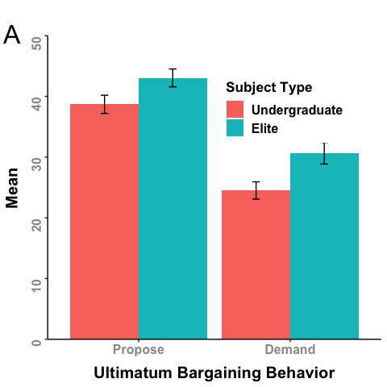
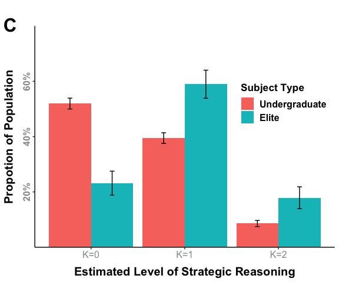

HW_B5
================
Yuhang Zhu
2023-11-29

## 1. Figure 1, Panel A

``` r
elite_ug <- read.csv("/Users/zhuyuhang/Desktop/Git/POLI210/Homeworks/B5/Replication data for - The Role of Self Interest in Elite Bargaining/elite.ug_1.csv")

head(elite_ug)
```

    ##   ult.min ult.propose levelk patience age experience elite
    ## 1      37          40      2       17  59         30     1
    ## 2      40          50      1        8  53         30     1
    ## 3      40          40      1        8  62         38     1
    ## 4      49          50      0        7  57         32     1
    ## 5       5          40      1        8  61         34     1
    ## 6      50          50      0        5  67         40     1

``` r
dim(elite_ug)
```

    ## [1] 234   7

``` r
## 1. Function of SEM
sem <- function(x){
  if(!is.numeric(x)){
    "Error: x needs to be a numeric variable"
  }
  x_complete <- na.omit(x)
  n <- length(x_complete)
  sd_hat <- sd(x_complete)
  sem <- sd_hat/sqrt(n)
  return(sem)   
}

## 2. Propose
### (1) College students
m_college_propose <- mean(elite_ug$ult.propose[elite_ug$elite == 0], na.rm = T)
m_college_propose
```

    ## [1] 38.69697

``` r
sem_college_propose <- sem(elite_ug$ult.propose[elite_ug$elite == 0])
sem_college_propose
```

    ## [1] 1.492945

``` r
### (2) Elite
m_elite_propose <- mean(elite_ug$ult.propose[elite_ug$elite == 1], na.rm = T)
m_elite_propose
```

    ## [1] 43.04902

``` r
sem_elite_propose <- sem(elite_ug$ult.propose[elite_ug$elite == 1])
sem_elite_propose
```

    ## [1] 1.471424

``` r
### (3) T-test_propose
D_hat_propose <- m_elite_propose - m_college_propose

se_D_hat_propose <- sqrt(var(elite_ug$ult.propose[elite_ug$elite == 1], na.rm = T) / 
                           sum(!is.na((elite_ug$ult.propose[elite_ug$elite == 1]))) + 
                           var(elite_ug$ult.propose[elite_ug$elite == 0], na.rm = T) /
                           (sum(!is.na((elite_ug$ult.propose[elite_ug$elite == 0])))))

test_statistic_propose <- (D_hat_propose - 0) / se_D_hat_propose

p_value_propose <- 2 * pnorm(- abs(test_statistic_propose))
p_value_propose
```

    ## [1] 0.03787727

``` r
### (4) Double-check
t.test(elite_ug$ult.propose[elite_ug$elite == 1], elite_ug$ult.propose[elite_ug$elite == 0], alternative = "two.sided")
```

    ## 
    ##  Welch Two Sample t-test
    ## 
    ## data:  elite_ug$ult.propose[elite_ug$elite == 1] and elite_ug$ult.propose[elite_ug$elite == 0]
    ## t = 2.0762, df = 228.93, p-value = 0.03899
    ## alternative hypothesis: true difference in means is not equal to 0
    ## 95 percent confidence interval:
    ##  0.221776 8.482324
    ## sample estimates:
    ## mean of x mean of y 
    ##  43.04902  38.69697

``` r
## 3. Demand
### (1) College students
m_college_demand <- mean(elite_ug$ult.min[elite_ug$elite == 0], na.rm = T)
m_college_demand
```

    ## [1] 24.50769

``` r
sem_college_demand <- sem(elite_ug$ult.min[elite_ug$elite == 0])
sem_college_demand
```

    ## [1] 1.423051

``` r
### (2) Elite
m_elite_demand <- mean(elite_ug$ult.min[elite_ug$elite == 1], na.rm = T)
m_elite_demand
```

    ## [1] 30.64286

``` r
sem_elite_demand <- sem(elite_ug$ult.min[elite_ug$elite == 1])
sem_elite_demand
```

    ## [1] 1.778335

``` r
### (3) T-test_propose
D_hat_demand <- m_elite_demand - m_college_demand

se_D_hat_demand <- sqrt(var(elite_ug$ult.min[elite_ug$elite == 1], na.rm = T) / 
                          sum(!is.na((elite_ug$ult.min[elite_ug$elite == 1]))) + 
                          var(elite_ug$ult.min[elite_ug$elite == 0], na.rm = T) / 
                          (sum(!is.na((elite_ug$ult.min[elite_ug$elite == 0])))))

test_statistic_demand <- (D_hat_demand - 0) / se_D_hat_demand

p_value_demand <- 2 * pnorm(- abs(test_statistic_demand))
p_value_demand
```

    ## [1] 0.00706692

``` r
### (4) Double-check
t.test(elite_ug$ult.min[elite_ug$elite == 1], elite_ug$ult.min[elite_ug$elite == 0], alternative = "two.sided")
```

    ## 
    ##  Welch Two Sample t-test
    ## 
    ## data:  elite_ug$ult.min[elite_ug$elite == 1] and elite_ug$ult.min[elite_ug$elite == 0]
    ## t = 2.6937, df = 199.49, p-value = 0.007669
    ## alternative hypothesis: true difference in means is not equal to 0
    ## 95 percent confidence interval:
    ##   1.643866 10.626464
    ## sample estimates:
    ## mean of x mean of y 
    ##  30.64286  24.50769

``` r
panel_a_data <- data.frame(
  subject = c(0, 1, 0, 1), # 0 = undergraduate, 1 = elite
  behavior = c(0, 0, 1, 1), # 0 = propose, 1 = demand
  m_behavior = c(m_college_propose, m_elite_propose, m_college_demand, m_elite_demand),
  se = c(sem_college_propose, sem_elite_propose, sem_college_demand, sem_elite_demand)
)

panel_a <- ggplot(panel_a_data, aes(factor(behavior), m_behavior, fill = factor(subject))) +
  geom_bar(stat = "identity", position = position_dodge()) +
  geom_errorbar(aes(ymin = m_behavior - se, ymax = m_behavior + se), width = .1, position=position_dodge(.9)) + 
  scale_x_discrete(labels = c("0" = "Propose", "1" = "Demand")) +
  scale_y_continuous(expand = c(0, 0), limits = c(0, 50)) +
  scale_fill_discrete(labels = c("0" = "Undergraduate", "1" = "Elite")) +
  labs(x = "Ultimatum Bargaining Behavior", y = "Mean", fill = "Subject Type") +
  theme(panel.background = element_rect(fill = "transparent", colour = NA),
        panel.border = element_blank(),
        panel.grid = element_blank(),
        axis.line = element_line(colour = "black"),
        axis.text.x = element_text(size = 12, face = "bold", colour = "grey60"),
        axis.text.y = element_text(size = 12, face = "bold", colour = "grey60", angle = 90),
        axis.title.x = element_text(margin = margin(t = 9), face = "bold", size = 15),
        axis.title.y = element_text(margin = margin(r = 9), face = "bold", size = 15),
        legend.text = element_text(face = "bold", size = 12),
        legend.title = element_text(face = "bold", size = 13),
        legend.position = c(.71, .76),
        legend.box.background = element_rect(fill = "transparent", color = NA))
panel_a
```

<!-- -->

``` r
## Note: The dataset used to generate panel a is panel_a_data, which is based on elite.ug_1.csv.
```

## 2. Figure 1, Panel B

``` r
elite_ug_lk <- read.csv("/Users/zhuyuhang/Desktop/Git/POLI210/Homeworks/B5/Replication data for - The Role of Self Interest in Elite Bargaining/elite.ug.lk.patience.dists.csv")

head(elite_ug_lk)
```

    ##   levelk patience elite L0 L1 L2
    ## 1      2       17     1  0  0  1
    ## 2      1        8     1  0  1  0
    ## 3      1        8     1  0  1  0
    ## 4      0        7     1  1  0  0
    ## 5      1        8     1  0  1  0
    ## 6      0        5     1  1  0  0

``` r
dim(elite_ug_lk)
```

    ## [1] 736   6

``` r
## 1. Patience
### (1) College students
m_college_patience <- mean(elite_ug_lk$patience[elite_ug_lk$elite == 0], na.rm = T)
m_college_patience
```

    ## [1] 6.881435

``` r
sem_college_patience <- sem(elite_ug_lk$patience[elite_ug_lk$elite == 0])
sem_college_patience
```

    ## [1] 0.2248948

``` r
### (2) Elite
m_elite_patience <- mean(elite_ug_lk$patience[elite_ug_lk$elite == 1], na.rm = T)
m_elite_patience
```

    ## [1] 10.30526

``` r
sem_elite_patience <- sem(elite_ug_lk$patience[elite_ug_lk$elite == 1])
sem_elite_patience
```

    ## [1] 0.5952544

``` r
### (3) T-test_propose
D_hat_patience <- m_elite_patience - m_college_patience

se_D_hat_patience <- sqrt(var(elite_ug_lk$patience[elite_ug_lk$elite == 1], na.rm = T) / 
                          sum(!is.na((elite_ug_lk$patience[elite_ug_lk$elite == 1]))) + 
                          var(elite_ug_lk$patience[elite_ug_lk$elite == 0], na.rm = T) / 
                          (sum(!is.na((elite_ug_lk$patience[elite_ug_lk$elite == 0])))))

test_statistic_patience <- (D_hat_patience - 0) / se_D_hat_patience

p_value_patience <- 2 * pnorm(- abs(test_statistic_patience))
p_value_patience
```

    ## [1] 7.421559e-08

``` r
### (4) Double-check
t.test(elite_ug_lk$patience[elite_ug_lk$elite == 1], elite_ug_lk$patience[elite_ug_lk$elite == 0], alternative = "two.sided") # The t-values are the same, but the p-values are different. Why? Maybe because DF is calculated differently?
```

    ## 
    ##  Welch Two Sample t-test
    ## 
    ## data:  elite_ug_lk$patience[elite_ug_lk$elite == 1] and elite_ug_lk$patience[elite_ug_lk$elite == 0]
    ## t = 5.3807, df = 122.38, p-value = 3.629e-07
    ## alternative hypothesis: true difference in means is not equal to 0
    ## 95 percent confidence interval:
    ##  2.164205 4.683451
    ## sample estimates:
    ## mean of x mean of y 
    ## 10.305263  6.881435

``` r
panel_b_data <- data.frame(
  subject = c(0, 1), # 0 = undergraduate, 1 = elite
  m_patience = c(m_college_patience, m_elite_patience),
  se = c(sem_college_patience, sem_elite_patience)
)

panel_b <- ggplot(panel_b_data, aes(factor(subject), m_patience)) +
  geom_bar(aes(fill = factor(subject)), stat = "identity", position = position_dodge()) +
  geom_errorbar(aes(ymin = m_patience - se, ymax = m_patience + se), width = .1, position=position_dodge(.9)) + 
  scale_x_discrete(labels = c("0" = "Undergraduate", "1" = "Elite")) +
  scale_y_continuous(expand = c(0.0, 0.0), limits = c(0.0, 11.0, 2.5)) +
  labs(x = "Subject Type", y = "Mean # of Patient Choices") +
  theme(panel.background = element_rect(fill = "transparent", colour = NA),
        panel.border = element_blank(),
        panel.grid = element_blank(),
        axis.line = element_line(colour = "black"),
        axis.text.x = element_text(size = 12, face = "bold", colour = "grey60"),
        axis.text.y = element_text(size = 12, face = "bold", colour = "grey60", angle = 90, hjust = .5),
        axis.title.x = element_text(margin = margin(t = 9), face = "bold", size = 15),
        axis.title.y = element_text(margin = margin(r = 9), face = "bold", size = 15)) + 
  guides(fill = FALSE)
```

    ## Warning: The `<scale>` argument of `guides()` cannot be `FALSE`. Use "none" instead as
    ## of ggplot2 3.3.4.
    ## This warning is displayed once every 8 hours.
    ## Call `lifecycle::last_lifecycle_warnings()` to see where this warning was
    ## generated.

``` r
panel_b
```

<!-- -->

``` r
## Note: The dataset used to generate panel b is panel_b_data, which is based on elite.ug.lk.patience.dists.csv.
```

## 3. Figure 1, Panel C

``` r
## 1. L0
### (1) College students
m_college_L0 <- mean(elite_ug_lk$L0[elite_ug_lk$elite == 0], na.rm = T)
m_college_L0
```

    ## [1] 0.5195008

``` r
sem_college_L0 <- sem(elite_ug_lk$L0[elite_ug_lk$elite == 0])
sem_college_L0
```

    ## [1] 0.0197492

``` r
### (2) Elite
m_elite_L0 <- mean(elite_ug_lk$L0[elite_ug_lk$elite == 1], na.rm = T)
m_elite_L0
```

    ## [1] 0.2315789

``` r
sem_elite_L0 <- sem(elite_ug_lk$L0[elite_ug_lk$elite == 1])
sem_elite_L0
```

    ## [1] 0.04350961

``` r
### (3) T-test_propose
D_hat_L0 <- m_elite_L0 - m_college_L0

se_D_hat_L0 <- sqrt(var(elite_ug_lk$L0[elite_ug_lk$elite == 1], na.rm = T) / 
                          sum(!is.na((elite_ug_lk$L0[elite_ug_lk$elite == 1]))) + 
                          var(elite_ug_lk$L0[elite_ug_lk$elite == 0], na.rm = T) / 
                          (sum(!is.na((elite_ug_lk$L0[elite_ug_lk$elite == 0])))))

test_statistic_L0 <- (D_hat_L0 - 0) / se_D_hat_L0

p_value_L0 <- 2 * pnorm(- abs(test_statistic_L0))
p_value_L0
```

    ## [1] 1.683363e-09

``` r
### (4) Double-check
t.test(elite_ug_lk$L0[elite_ug_lk$elite == 1], elite_ug_lk$L0[elite_ug_lk$elite == 0], alternative = "two.sided")
```

    ## 
    ##  Welch Two Sample t-test
    ## 
    ## data:  elite_ug_lk$L0[elite_ug_lk$elite == 1] and elite_ug_lk$L0[elite_ug_lk$elite == 0]
    ## t = -6.0257, df = 135.88, p-value = 1.492e-08
    ## alternative hypothesis: true difference in means is not equal to 0
    ## 95 percent confidence interval:
    ##  -0.3824144 -0.1934293
    ## sample estimates:
    ## mean of x mean of y 
    ## 0.2315789 0.5195008

``` r
## 2. L1
### (1) College students
m_college_L1 <- mean(elite_ug_lk$L1[elite_ug_lk$elite == 0], na.rm = T)
m_college_L1
```

    ## [1] 0.3946958

``` r
sem_college_L1 <- sem(elite_ug_lk$L1[elite_ug_lk$elite == 0])
sem_college_L1
```

    ## [1] 0.01932093

``` r
### (2) Elite
m_elite_L1 <- mean(elite_ug_lk$L1[elite_ug_lk$elite == 1], na.rm = T)
m_elite_L1
```

    ## [1] 0.5894737

``` r
sem_elite_L1 <- sem(elite_ug_lk$L1[elite_ug_lk$elite == 1])
sem_elite_L1
```

    ## [1] 0.05073864

``` r
### (3) T-test_propose
D_hat_L1 <- m_elite_L1 - m_college_L1

se_D_hat_L1 <- sqrt(var(elite_ug_lk$L1[elite_ug_lk$elite == 1], na.rm = T) / 
                          sum(!is.na((elite_ug_lk$L1[elite_ug_lk$elite == 1]))) + 
                          var(elite_ug_lk$L1[elite_ug_lk$elite == 0], na.rm = T) / 
                          (sum(!is.na((elite_ug_lk$L1[elite_ug_lk$elite == 0])))))

test_statistic_L1 <- (D_hat_L1 - 0) / se_D_hat_L1

p_value_L1 <- 2 * pnorm(- abs(test_statistic_L1))
p_value_L1
```

    ## [1] 0.000333805

``` r
### (4) Double-check
t.test(elite_ug_lk$L1[elite_ug_lk$elite == 1], elite_ug_lk$L1[elite_ug_lk$elite == 0], alternative = "two.sided")
```

    ## 
    ##  Welch Two Sample t-test
    ## 
    ## data:  elite_ug_lk$L1[elite_ug_lk$elite == 1] and elite_ug_lk$L1[elite_ug_lk$elite == 0]
    ## t = 3.5875, df = 122.86, p-value = 0.0004803
    ## alternative hypothesis: true difference in means is not equal to 0
    ## 95 percent confidence interval:
    ##  0.0873074 0.3022484
    ## sample estimates:
    ## mean of x mean of y 
    ## 0.5894737 0.3946958

``` r
## 3. L2
### (1) College students
m_college_L2 <- mean(elite_ug_lk$L2[elite_ug_lk$elite == 0], na.rm = T)
m_college_L2
```

    ## [1] 0.08580343

``` r
sem_college_L2 <- sem(elite_ug_lk$L2[elite_ug_lk$elite == 0])
sem_college_L2
```

    ## [1] 0.01107088

``` r
### (2) Elite
m_elite_L2 <- mean(elite_ug_lk$L2[elite_ug_lk$elite == 1], na.rm = T)
m_elite_L2
```

    ## [1] 0.1789474

``` r
sem_elite_L2 <- sem(elite_ug_lk$L2[elite_ug_lk$elite == 1])
sem_elite_L2
```

    ## [1] 0.03953523

``` r
### (3) T-test_propose
D_hat_L2 <- m_elite_L2 - m_college_L2

se_D_hat_L2 <- sqrt(var(elite_ug_lk$L2[elite_ug_lk$elite == 1], na.rm = T) / 
                          sum(!is.na((elite_ug_lk$L2[elite_ug_lk$elite == 1]))) + 
                          var(elite_ug_lk$L2[elite_ug_lk$elite == 0], na.rm = T) / 
                          (sum(!is.na((elite_ug_lk$L2[elite_ug_lk$elite == 0])))))

test_statistic_L2 <- (D_hat_L2 - 0) / se_D_hat_L2

p_value_L2 <- 2 * pnorm(- abs(test_statistic_L2))
p_value_L2
```

    ## [1] 0.02328643

``` r
### (4) Double-check
t.test(elite_ug_lk$L2[elite_ug_lk$elite == 1], elite_ug_lk$L2[elite_ug_lk$elite == 0], alternative = "two.sided")
```

    ## 
    ##  Welch Two Sample t-test
    ## 
    ## data:  elite_ug_lk$L2[elite_ug_lk$elite == 1] and elite_ug_lk$L2[elite_ug_lk$elite == 0]
    ## t = 2.2687, df = 109.22, p-value = 0.02525
    ## alternative hypothesis: true difference in means is not equal to 0
    ## 95 percent confidence interval:
    ##  0.01177405 0.17451382
    ## sample estimates:
    ##  mean of x  mean of y 
    ## 0.17894737 0.08580343

``` r
panel_c_data <- data.frame(
  subject = c(0, 1, 0, 1, 0, 1), # 0 = undergraduate, 1 = elite
  level = c(0, 0, 1, 1, 2, 2), # 0 = L0, 1 = L1, 2 = L2
  m_level = c(m_college_L0, m_elite_L0, m_college_L1, m_elite_L1, m_college_L2, m_elite_L2),
  se = c(sem_college_L0, sem_elite_L0, sem_college_L1, sem_elite_L1, sem_college_L2, sem_elite_L2)
)

panel_c <- ggplot(panel_c_data, aes(factor(level), m_level, fill = factor(subject))) +
  geom_bar(stat = "identity", position = position_dodge()) +
  geom_errorbar(aes(ymin = m_level - se, ymax = m_level + se), width = .1, position=position_dodge(.9)) + 
  scale_x_discrete(labels = c("0" = "K=0", "1" = "K=1", "2" = "K=2")) +
  scale_y_continuous(labels = scales::percent, expand = c(0, 0), limits = c(.0, .8), breaks = seq(.2, .6, .2)) +
  scale_fill_discrete(labels = c("0" = "Undergraduate", "1" = "Elite")) +
  labs(x = "Estimated Level of Strategic Reasoning", y = "Propotion of Population", fill = "Subject Type") +
  theme(panel.background = element_rect(fill = "transparent", colour = NA),
        panel.border = element_blank(),
        panel.grid = element_blank(),
        axis.line = element_line(colour = "black"),
        axis.text.x = element_text(size = 12, face = "bold", colour = "grey60"),
        axis.text.y = element_text(size = 12, face = "bold", colour = "grey60", angle = 90, hjust = .5),
        axis.title.x = element_text(margin = margin(t = 9), face = "bold", size = 15),
        axis.title.y = element_text(margin = margin(r = 9), face = "bold", size = 15),
        legend.text = element_text(face = "bold", size = 12),
        legend.title = element_text(face = "bold", size = 13),
        legend.position = c(.83, .65),
        legend.box.background = element_rect(fill = "transparent", color = NA))
panel_c
```

<!-- -->

``` r
## Note: The dataset used to generate panel c is panel_c_data, which is based on elite.ug.lk.patience.dists.csv.
```

### 
