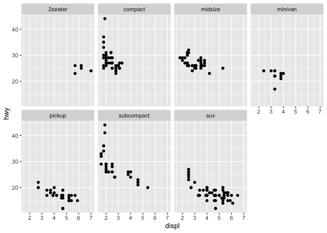
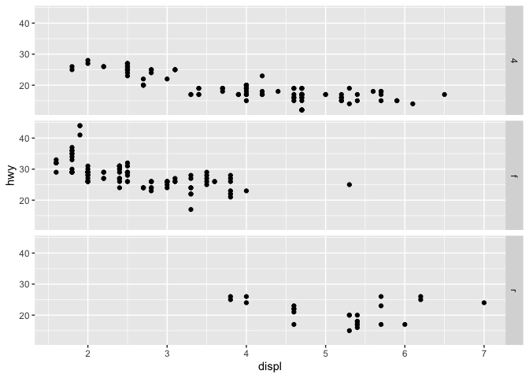
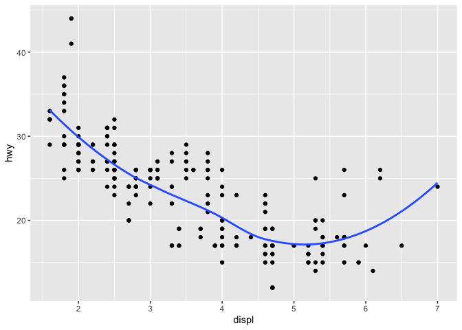
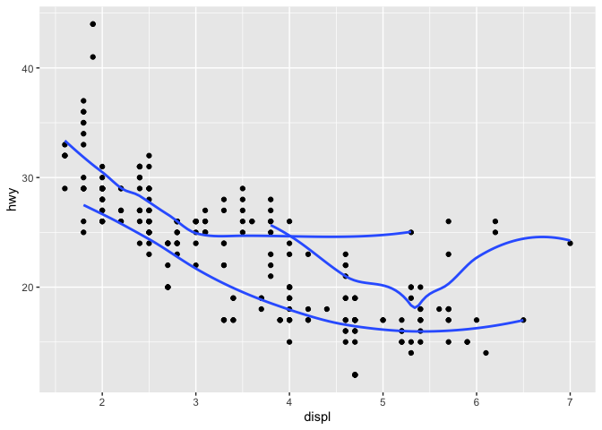
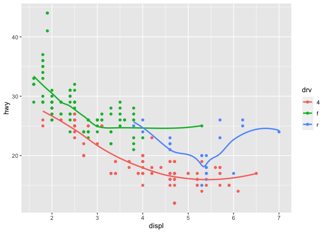
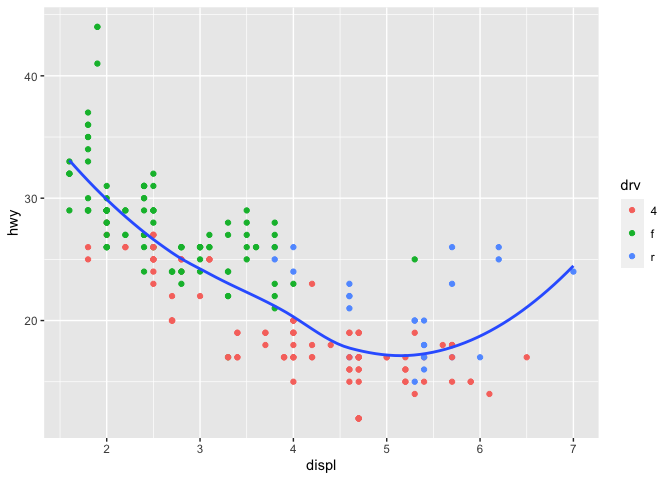
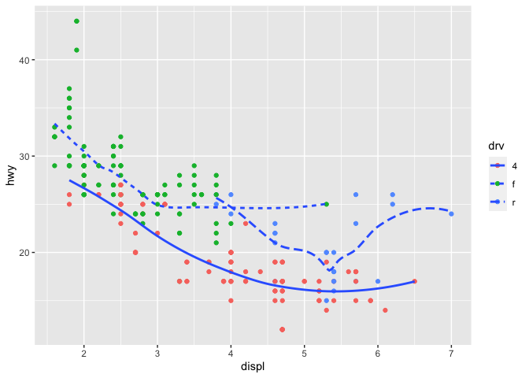
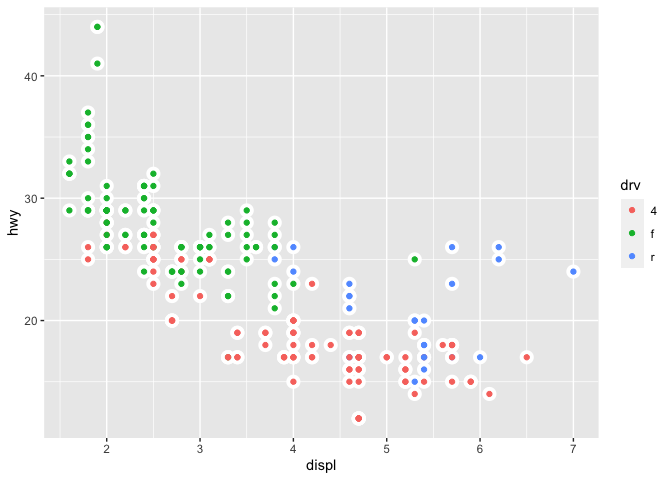

R for Data Science Notes
================
Yuhang Zhu
2023-08-28

## 3 Data visualisation

``` r
library(tidyverse)
```

    ## ── Attaching core tidyverse packages ──────────────────────── tidyverse 2.0.0 ──
    ## ✔ dplyr     1.1.2     ✔ readr     2.1.4
    ## ✔ forcats   1.0.0     ✔ stringr   1.5.0
    ## ✔ ggplot2   3.4.3     ✔ tibble    3.2.1
    ## ✔ lubridate 1.9.2     ✔ tidyr     1.3.0
    ## ✔ purrr     1.0.2     
    ## ── Conflicts ────────────────────────────────────────── tidyverse_conflicts() ──
    ## ✖ dplyr::filter() masks stats::filter()
    ## ✖ dplyr::lag()    masks stats::lag()
    ## ℹ Use the conflicted package (<http://conflicted.r-lib.org/>) to force all conflicts to become errors

``` r
library(ggplot2)
```

``` r
mpg
```

    ## # A tibble: 234 × 11
    ##    manufacturer model      displ  year   cyl trans drv     cty   hwy fl    class
    ##    <chr>        <chr>      <dbl> <int> <int> <chr> <chr> <int> <int> <chr> <chr>
    ##  1 audi         a4           1.8  1999     4 auto… f        18    29 p     comp…
    ##  2 audi         a4           1.8  1999     4 manu… f        21    29 p     comp…
    ##  3 audi         a4           2    2008     4 manu… f        20    31 p     comp…
    ##  4 audi         a4           2    2008     4 auto… f        21    30 p     comp…
    ##  5 audi         a4           2.8  1999     6 auto… f        16    26 p     comp…
    ##  6 audi         a4           2.8  1999     6 manu… f        18    26 p     comp…
    ##  7 audi         a4           3.1  2008     6 auto… f        18    27 p     comp…
    ##  8 audi         a4 quattro   1.8  1999     4 manu… 4        18    26 p     comp…
    ##  9 audi         a4 quattro   1.8  1999     4 auto… 4        16    25 p     comp…
    ## 10 audi         a4 quattro   2    2008     4 manu… 4        20    28 p     comp…
    ## # ℹ 224 more rows

``` r
ggplot(mpg, aes(displ, hwy)) +
  geom_point()
```

<!-- -->

``` r
ggplot(data = <DATA>) + 
  <GEOM_FUNCTION>(mapping = aes(<MAPPINGS>))
```

``` r
ggplot(mpg) +
  geom_point(aes(displ, hwy, color = class))
```

<!-- -->

``` r
ggplot(mpg) +
  geom_point(aes(displ, hwy, size = class))
```

    ## Warning: Using size for a discrete variable is not advised.

<!-- -->

``` r
ggplot(mpg) +
  geom_point(aes(displ, hwy, alpha = class))
```

    ## Warning: Using alpha for a discrete variable is not advised.

<!-- -->

``` r
ggplot(data = mpg) + 
  geom_point(mapping = aes(x = displ, y = hwy, shape = class))
```

    ## Warning: The shape palette can deal with a maximum of 6 discrete values because
    ## more than 6 becomes difficult to discriminate; you have 7. Consider
    ## specifying shapes manually if you must have them.

    ## Warning: Removed 62 rows containing missing values (`geom_point()`).

<!-- -->

``` r
ggplot(data = mpg) + 
  geom_point(mapping = aes(x = displ, y = hwy), color = "blue")
```

<!-- -->

``` r
ggplot(mpg, aes(displ, hwy)) + 
  geom_point(shape = 21, color = "black", fill = "white", size = 2, stroke = 1) # Use the stroke aesthetic to modify the width of the border
```

<!-- -->

``` r
ggplot(mpg, aes(displ, hwy, color = displ < 5)) + 
  geom_point()
```

<!-- -->

``` r
ggplot(mpg, aes(displ, hwy)) +
  geom_point() +
  facet_wrap( ~ class, nrow = 2)
```

<!-- -->

``` r
ggplot(mpg, aes(displ, hwy)) +
  geom_point() +
  facet_grid(drv ~ cyl)
```

<!-- -->

``` r
ggplot(mpg, aes(displ, hwy)) +
  geom_point() +
  facet_grid(. ~ cyl)
```

<!-- -->

``` r
ggplot(data = mpg) + 
  geom_point(mapping = aes(x = displ, y = hwy)) +
  facet_grid(drv ~ .)
```

<!-- -->

``` r
ggplot(data = mpg) + 
  geom_point(mapping = aes(x = displ, y = hwy)) +
  facet_grid(. ~ cyl)
```

<!-- -->

``` r
ggplot(mpg, aes(displ, hwy)) +
  geom_point()
```

<!-- -->

``` r
ggplot(mpg, aes(displ, hwy)) +
  geom_smooth()
```

    ## `geom_smooth()` using method = 'loess' and formula = 'y ~ x'

<!-- -->

``` r
ggplot(mpg, aes(displ, hwy, linetype = drv)) +
  geom_smooth()
```

    ## `geom_smooth()` using method = 'loess' and formula = 'y ~ x'

<!-- -->

``` r
ggplot(data = mpg) +
  geom_smooth(mapping = aes(x = displ, y = hwy))
```

    ## `geom_smooth()` using method = 'loess' and formula = 'y ~ x'

<!-- -->

``` r
ggplot(data = mpg) +
  geom_smooth(mapping = aes(x = displ, y = hwy, group = drv))
```

    ## `geom_smooth()` using method = 'loess' and formula = 'y ~ x'

<!-- -->

``` r
ggplot(data = mpg) +
  geom_smooth(
    mapping = aes(x = displ, y = hwy, color = drv),
    show.legend = FALSE
  )
```

    ## `geom_smooth()` using method = 'loess' and formula = 'y ~ x'

<!-- -->

``` r
ggplot(mpg, aes(displ, hwy)) +
  geom_point(aes(color = drv)) +
  geom_smooth(aes(linetype = drv))
```

    ## `geom_smooth()` using method = 'loess' and formula = 'y ~ x'

<!-- -->

``` r
ggplot(mpg, aes(displ, hwy)) +
  geom_point(aes(color = class)) +
  geom_smooth(data = filter(mpg, class == "subcompact"), se = F)
```

    ## `geom_smooth()` using method = 'loess' and formula = 'y ~ x'

<!-- -->

``` r
ggplot(data = mpg, mapping = aes(x = displ, y = hwy, color = drv)) + 
  geom_point() + 
  geom_smooth(se = FALSE)
```

    ## `geom_smooth()` using method = 'loess' and formula = 'y ~ x'

<!-- -->

``` r
ggplot(mpg, aes(displ, hwy)) +
  geom_point() +
  geom_smooth(se = F)
```

    ## `geom_smooth()` using method = 'loess' and formula = 'y ~ x'

<!-- -->

``` r
ggplot(mpg, aes(displ, hwy)) +
  geom_point() +
  geom_smooth(aes(group = drv), se = F)
```

    ## `geom_smooth()` using method = 'loess' and formula = 'y ~ x'

<!-- -->

``` r
ggplot(mpg, aes(displ, hwy, color = drv)) +
  geom_point() +
  geom_smooth(se = F)
```

    ## `geom_smooth()` using method = 'loess' and formula = 'y ~ x'

<!-- -->

``` r
ggplot(mpg, aes(displ, hwy)) +
  geom_point(aes(color = drv)) +
  geom_smooth(se = F)
```

    ## `geom_smooth()` using method = 'loess' and formula = 'y ~ x'

<!-- -->

``` r
ggplot(mpg, aes(displ, hwy)) +
  geom_point(aes(color = drv)) +
  geom_smooth(aes(linetype = drv), se = F)
```

    ## `geom_smooth()` using method = 'loess' and formula = 'y ~ x'

<!-- -->

``` r
ggplot(mpg, aes(displ, hwy, color = drv)) +
  geom_point(color = "white", size = 1, stroke = 3) + 
  geom_point()
```

<!-- -->

``` r
ggplot(diamonds, aes(x = cut)) +
  geom_bar()
```

<!-- -->

``` r
ggplot(diamonds, aes(x = cut)) +
  stat_count()
```

<!-- -->

``` r
demo <- tribble(
  ~cut,         ~freq,
  "Fair",       1610,
  "Good",       4906,
  "Very Good",  12082,
  "Premium",    13791,
  "Ideal",      21551
)

ggplot(data = demo) +
  geom_bar(mapping = aes(x = cut, y = freq), stat = "identity") # stat = "identity": 这表示我们已经提供了每个条形的高度（即freq列），所以不需要进行任何统计转换。
```

<!-- -->

``` r
ggplot(data = diamonds) + 
  geom_bar(mapping = aes(x = cut, y = stat(prop), group = 1)) # group = 1: 这是一个特殊的设置，用于确保stat(prop)计算的是整个数据集的比例，而不是每个cut类别内部的比例。
```

    ## Warning: `stat(prop)` was deprecated in ggplot2 3.4.0.
    ## ℹ Please use `after_stat(prop)` instead.
    ## This warning is displayed once every 8 hours.
    ## Call `lifecycle::last_lifecycle_warnings()` to see where this warning was
    ## generated.

<!-- -->

``` r
ggplot(data = diamonds) + 
  stat_summary(
    mapping = aes(x = cut, y = depth),
    fun.min = min,
    fun.max = max,
    fun = median
  )
```

<!-- -->

``` r
ggplot(diamonds, aes(cut, depth)) +
  geom_col( ) # 使用geom_bar()当你有未汇总的数据，并希望通过计数每个类别的观察次数来创建条形图，使用geom_col()当你有已汇总的数据，或当你有一个表示条形高度的变量。
```

<!-- -->

``` r
ggplot(data = diamonds) + 
  geom_bar(mapping = aes(x = cut, y = after_stat(prop), group = 1))
```

<!-- -->

``` r
ggplot(data = diamonds) + 
  geom_bar(mapping = aes(x = cut, fill = color, y = after_stat(prop), group = 1))
```

    ## Warning: The following aesthetics were dropped during statistical transformation: fill
    ## ℹ This can happen when ggplot fails to infer the correct grouping structure in
    ##   the data.
    ## ℹ Did you forget to specify a `group` aesthetic or to convert a numerical
    ##   variable into a factor?

<!-- -->

``` r
ggplot(data = diamonds) + 
  geom_bar(mapping = aes(x = cut, colour = cut))
```

<!-- -->

``` r
ggplot(data = diamonds) + 
  geom_bar(mapping = aes(x = cut, fill = cut))
```

<!-- -->

``` r
ggplot(data = diamonds) + 
  geom_bar(mapping = aes(x = cut, fill = clarity))
```

<!-- -->

``` r
ggplot(data = diamonds, mapping = aes(x = cut, fill = clarity)) + 
  geom_bar(alpha = 1/5, position = "identity")
```

<!-- -->

``` r
ggplot(data = diamonds, mapping = aes(x = cut, colour = clarity)) + 
  geom_bar(fill = NA, position = "identity")
```

<!-- -->

``` r
ggplot(data = diamonds) + 
  geom_bar(mapping = aes(x = cut, fill = clarity), position = "fill")
```

<!-- -->

``` r
ggplot(data = diamonds) + 
  geom_bar(mapping = aes(x = cut, fill = clarity), position = "dodge")
```

<!-- -->

``` r
ggplot(data = mpg) + 
  geom_point(mapping = aes(x = displ, y = hwy), position = "jitter")
```

<!-- -->

``` r
ggplot(data = mpg, mapping = aes(x = cty, y = hwy)) + 
  geom_point(position = "jitter")
```

<!-- -->

``` r
ggplot(mpg, aes(class, hwy)) + 
  geom_boxplot()
```

<!-- -->

``` r
ggplot(data = mpg, mapping = aes(x = class, y = hwy)) + 
  geom_boxplot()
```

<!-- -->

``` r
ggplot(data = mpg, mapping = aes(x = class, y = hwy)) + 
  geom_boxplot() +
  coord_flip()
```

<!-- -->

``` r
nz <- map_data("nz")

ggplot(nz, aes(long, lat, group = group)) +
  geom_polygon(fill = "white", colour = "black")
```

<!-- -->

``` r
ggplot(nz, aes(long, lat, group = group)) +
  geom_polygon(fill = "white", colour = "black") +
  coord_quickmap()
```

<!-- -->

``` r
bar <- ggplot(data = diamonds) + 
  geom_bar(
    mapping = aes(x = cut, fill = cut), 
    show.legend = FALSE,
    width = 1
  ) + 
  theme(aspect.ratio = 1) +
  labs(x = NULL, y = NULL)

bar + coord_flip()
```

<!-- -->

``` r
bar + coord_polar()
```

<!-- -->

``` r
ggplot(data = mpg, mapping = aes(x = cty, y = hwy)) +
  geom_point() + 
  geom_abline() +
  coord_fixed()
```

<!-- -->

``` r
ggplot(data = <DATA>) + 
  <GEOM_FUNCTION>(
     mapping = aes(<MAPPINGS>),
     stat = <STAT>, 
     position = <POSITION>
  ) +
  <COORDINATE_FUNCTION> +
  <FACET_FUNCTION>
```

## 4 Workflow: basics

``` r
seq(1, 10)
```

    ##  [1]  1  2  3  4  5  6  7  8  9 10

``` r
x <- "hello, world"

y <- seq(1, 10, length.out = 5)
y
```

    ## [1]  1.00  3.25  5.50  7.75 10.00

``` r
(y <- seq(1, 10, length.out = 5))
```

    ## [1]  1.00  3.25  5.50  7.75 10.00

## 27 R Markdown

### 27.3 Text formatting with Markdown

Text formatting

``` r
*italic*  or _italic_  
**bold**   __bold__  
`code`  
superscript^2^ and subscript~2~
```

Headings

``` r
# 1st Level Header

## 2nd Level Header

### 3rd Level Header
```

Lists

``` r
*   Bulleted list item 1

*   Item 2

    * Item 2a

    * Item 2b

1.  Numbered list item 1

1.  Item 2. The numbers are incremented automatically in the output.
```

Links and images

``` r
<http://example.com>

[linked phrase](http://example.com)


```

Tables

``` r
First Header  | Second Header
------------- | -------------
Content Cell  | Content Cell
Content Cell  | Content Cell
```

### 27.4 Code chunks

#### 27.4.1 Chunk name

``` r
number <- c(1, 3, 5, 6,87)
```

There is one chunk name that imbues special behavior: setup. When you’re
in a notebook mode, the chunk named setup will be run automatically
once, before any other code is run.

#### 27.4.2 Chunk options

- The most important set of options controls if your code block is
  executed and what results are inserted in the finished report:
- `eval = FALSE` prevents code from being evaluated. (And obviously if
  the code is not run, no results will be generated). This is useful for
  displaying example code, or for disabling a large block of code
  without commenting each line.
- `include = FALSE` runs the code, but doesn’t show the code or results
  in the final document. Use this for setup code that you don’t want
  cluttering your report.
- `echo = FALSE` prevents code, but not the results from appearing in
  the finished file. Use this when writing reports aimed at people who
  don’t want to see the underlying R code.
- `message = FALSE` or `warning = FALSE` prevents messages or warnings
  from appearing in the finished file.
- `results = 'hide'` hides printed output; `fig.show = 'hide'` hides
  plots.
- `error = TRUE` causes the render to continue even if code returns an
  error. This is rarely something you’ll want to include in the final
  version of your report, but can be very useful if you need to debug
  exactly what is going on inside your .Rmd. It’s also useful if you’re
  teaching R and want to deliberately include an error. The default,
  `error = FALSE` causes knitting to fail if there is a single error in
  the document.

#### 27.4.3 Table

``` r
knitr::kable(
  mtcars[1:5, ], 
  caption = "A knitr kable")
```

|                   |  mpg | cyl | disp |  hp | drat |    wt |  qsec |  vs |  am | gear | carb |
|:------------------|-----:|----:|-----:|----:|-----:|------:|------:|----:|----:|-----:|-----:|
| Mazda RX4         | 21.0 |   6 |  160 | 110 | 3.90 | 2.620 | 16.46 |   0 |   1 |    4 |    4 |
| Mazda RX4 Wag     | 21.0 |   6 |  160 | 110 | 3.90 | 2.875 | 17.02 |   0 |   1 |    4 |    4 |
| Datsun 710        | 22.8 |   4 |  108 |  93 | 3.85 | 2.320 | 18.61 |   1 |   1 |    4 |    1 |
| Hornet 4 Drive    | 21.4 |   6 |  258 | 110 | 3.08 | 3.215 | 19.44 |   1 |   0 |    3 |    1 |
| Hornet Sportabout | 18.7 |   8 |  360 | 175 | 3.15 | 3.440 | 17.02 |   0 |   0 |    3 |    2 |

A knitr kable
